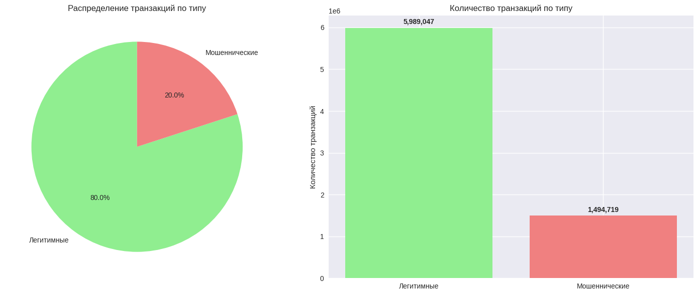
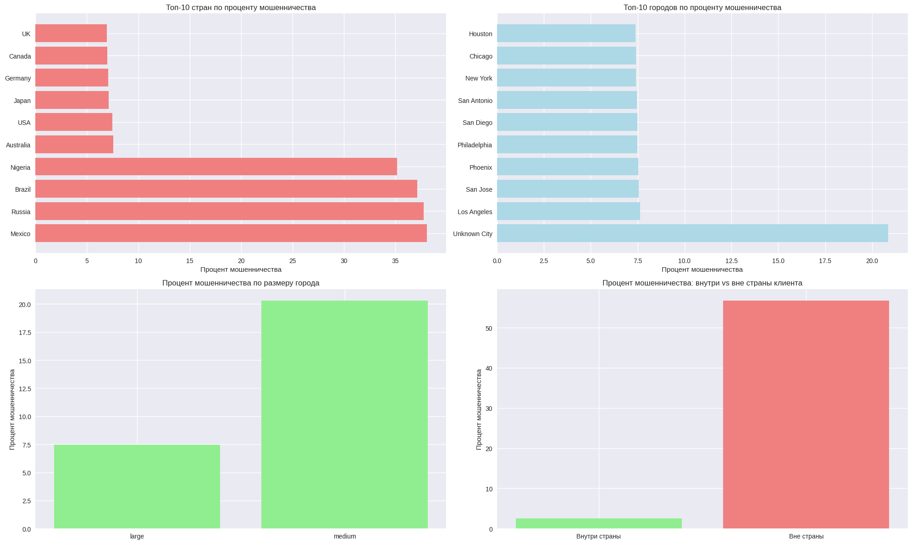

# Задание

Провести разведочный анализ данных, придумать продуктовые и технические гипотезы — какую ценность можете извлечь из данных для организации, которая предоставила данные.

## Инструменты

Данные загружаются с использованием `pandas`, анализируются с примененим `numpy` и отображаются с использованием `seaborn`, `matplotlib` и `plotly`.

## Основные инсайты

- Данные полные, пропусков нет.

- Переменная is_fraud: 20% всех транзакций являются мошенническими. Данные несбалансированные

- Временные зависимости: большинство транзакций в ночное время в начале недели

- Суммы транзакций:
  - мошеннические в основном небольшие суммы (<25k)
  - суммы транзакций распределены логнормально
  - мошеннические транзакции в процентном соотношении происходят основном с небольшими суммами либо с очень большими

- Вендоры:
  - равномерное распределение мошеннических транзакций по категориям и по типу

- Географические паттерны:
  - топ 4 страны: Mexico, Russia, Brazil, Nigeria
  - топ 4 города по проценту мошенничества (минимум 100 транзакций): Los Angeles, San Jose, Phoenix, Philadelphia
  - в больших городах процент мошенничества в 3 раза выше
  - в основном мошеннические операции происходят с транзакциям клиентов когда они находятся вне страны

- Способы совершения мошенничества в разрезе устройств и каналов
  - Основные устройства (минимум 100 транзакций): Chip Reader, Magnetic Stripe, NFC Payment
  - По каналам: pos-терминалы
  - в основном это кредитные карты

- Анализ активности за последний час:
  - есть положительно коррелированные признаки:
    - Число уникальных стран (`unique_countries`) ~ Число уникальных продавцов (`unique_merchants`), корреляция 0.88
    - Число уникальных продавцов (`unique_merchants`) ~ Количество транзакций (`num_transactions`), корреляция 0.68
  - корреляция с целевым признаком `is_fraud` низкая

- Мошенничество в разрезе валют:
  - топ-4 валют: MXN, RUB, BRL, NGN
  - максимальное количество общих транзакций происходит в EUR
  - все валюты имеют высокую корреляцию

- Мошенничество в выходные дни:
  - процент мошенничества не зависит от фактора выходного дня

## Продуктовые и технические гипотезы

### Продуктовые

1. **Географические паттерны мошенничества**

   - Гипотеза: Мошенничество чаще происходит в определенных странах ( Mexico, Russia, Brazil, Nigeria) и больших городах
   - Ценность: Фокус на высокорисковых регионах, персонализация проверок в больших городах, особое внимание когда клиенты вне своих стран

2. **Временные паттерны активности**

   - Гипотеза: Мошеннические транзакции имеют специфические временные паттерны:в ночное время, в начале недели, небольше и очень большие суммы
   - Ценность: Улучшение алгоритмов в реальном времени, оптимизация ресурсов (распределение на ночное время и начало недели)

3. **Поведенческие паттерны клиентов**

   - Гипотеза: Аномальная активность за короткий период указывает на мошенничество
   - Ценность: Раннее выявление, улучшение пользовательского опыта

4. **Устройства и каналы**
   - Гипотеза: Определенные устройства и каналы более уязвимы для мошенничества:
     - Chip Reader, Magnetic Stripe, NFC Payment
     - pos-терминалы
     - кредитные карты
   - Ценность: Улучшение безопасности, фокус на проблемных каналах

### Технические гипотезы

1. **Feature Engineering**

   - Создание новых признаков на основе временных паттернов и корреляций
   - логарифмирование сумм транзакций позволит нормализовать распределение
   - Агрегация транзакций по клиентам и временным окнам
   - Нормализация сумм по валютам

2. **Моделирование**

   - Использование ансамблевых методов (Random Forest, XGBoost, LightGBM, CatBoost)
   - Применение методов для несбалансированных данных (Random Oversampling / SMOTE / Undersampling, Class Weighting, Random Forest с балансировкой)
   - Использование метрик, устойчивых к дисбалансу:
     - Precision, Recall, F1-Score
     - ROC-AUC, PR-AUC
   - Временные модели (LSTM, GRU) для последовательностей транзакций

3. **Оптимизация**

   - Балансировка классов (SMOTE, undersampling)
   - Подбор порогов классификации
   - Кросс-валидация с временными разбиениями

4. **Мониторинг**
   - A/B тестирование новых алгоритмов
   - Мониторинг drift'а данных
   - Автоматическое обновление моделей

### Бизнес ценность

1. **Снижение потерь**: Уменьшение финансовых потерь от мошенничества
2. **Улучшение UX**: Снижение количества ложных срабатываний
3. **Оптимизация ресурсов**: Фокус на высокорисковых транзакциях
4. **Конкурентное преимущество**: Более безопасная платформа
5. **Соответствие регуляторным требованиям**: Улучшение compliance
